# ThePhishStack

<br/>
<div align="center">
  
  <h3 align="center">ThePhish for DFIR-IRIS with Cortex</h3>
</div>

[ThePhish](https://github.com/emalderson/ThePhish/tree/master) is an automated phishing email analysis tool. It's a web application written in Python 3 and based on Flask that automates the entire analysis process, starting from the extraction of the observables from the header and the body of an email to the elaboration of a verdict, which is final in most cases. The original ThePhish was designed to work with [TheHive](https://github.com/TheHive-Project/TheHive), [Cortex](https://github.com/TheHive-Project/Cortex/) and [MISP](https://github.com/MISP/MISP).

This version of ThePhish, designated as **ThePhishStack**, is a fork modified to work with [DFIR-IRIS](https://github.com/dfir-iris/iris-web) and Cortex.

In order to interact with DFIR-IRIS, it uses the [REST API](https://docs.dfir-iris.org/operations/api/#references) provided by the solution.


[](https://www.python.org/)


[](./LICENSE)

## Table of contents

- [ThePhishStack](#thephishstack)
  - [Table of contents](#table-of-contents)
  - [Overview](#overview)
  - [ThePhish example usage](#thephish-example-usage)
    - [A user sends an email to ThePhish](#a-user-sends-an-email-to-thephish)
    - [The analyst analyzes the email](#the-analyst-analyzes-the-email)
  - [Requirements](#requirements)
  - [Installation](#installation)
  - [Configuration](#configuration)
    - [Container Environment Variables](#container-environment-variables)
    - [configuration.json](#configurationjson)
    - [analyzers\_level\_conf.json](#analyzers_level_confjson)
    - [whitelist.json](#whitelistjson)
    - [Reverse Proxy](#reverse-proxy)

## Overview

The following diagram shows how **ThePhishStack** works:

<div align="center">
  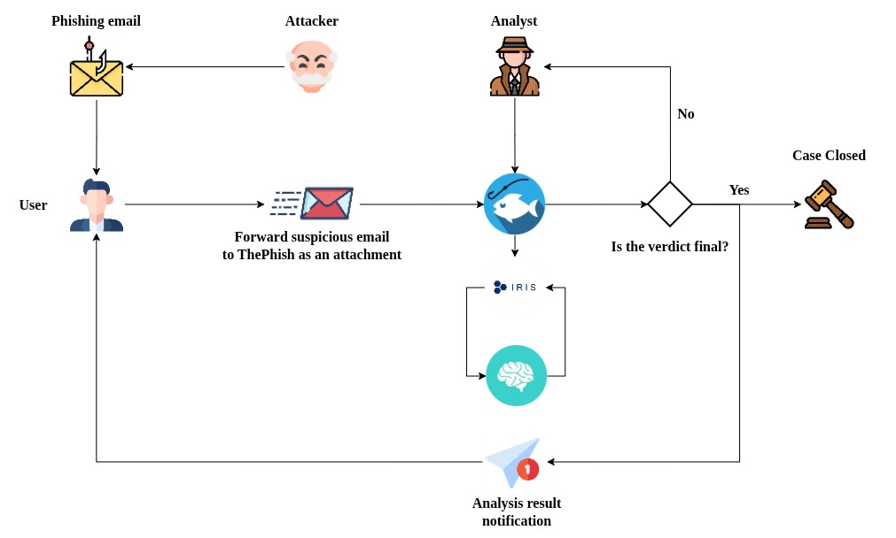
</div>

  1. An attacker starts a phishing campaign and sends a phishing email to a user.
  2. A user who receives such an email can send that email as an attachment to the mailbox used by ThePhish.
  3. The analyst interacts with ThePhish and selects the email to analyze.
  4. ThePhish extracts all the observables from the email and creates a case on DFIR-IRIS. The IOCs are analyzed thanks to Cortex and its analyzers.
  5. ThePhish calculates a verdict based on the verdicts of the analyzers.
  6. If the verdict is final, the user is notified and the case is closed.
  7. If the verdict is not final, the analyst's intervention is required. He must review the case on DFIR-IRIS along with the results given by the various analyzers to formulate a verdict, then he can send the notification to the user and close the case.

## ThePhish example usage

This example aims to demonstrate how a user can send an email to ThePhish for it to be analyzed and how an analyst can actually analyze that email using ThePhish.

### A user sends an email to ThePhish

A user can send an email to the address used by ThePhish to be analyzed. The email has to be forwarded as an attachment in EML format to prevent the contamination of the email header.

An example of this process for multiple email clients can be seen below:

+ Outlook:

  <div align="center">
    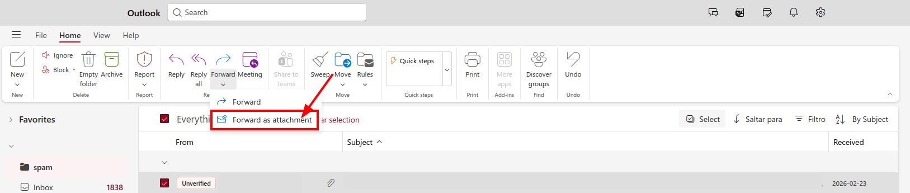
  </div>

+ Gmail:

  <div align="center">
    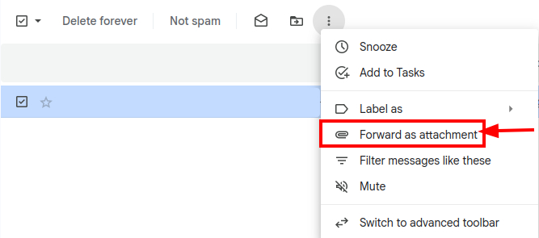
  </div>

+ Thunderbird:

  <div align="center">
    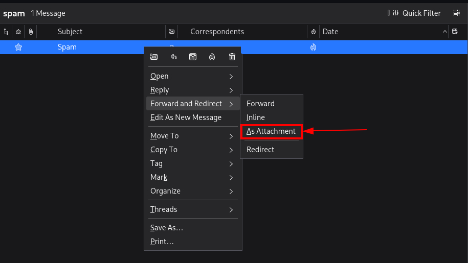
  </div>

+ Apple Mail:

  <div align="center">
    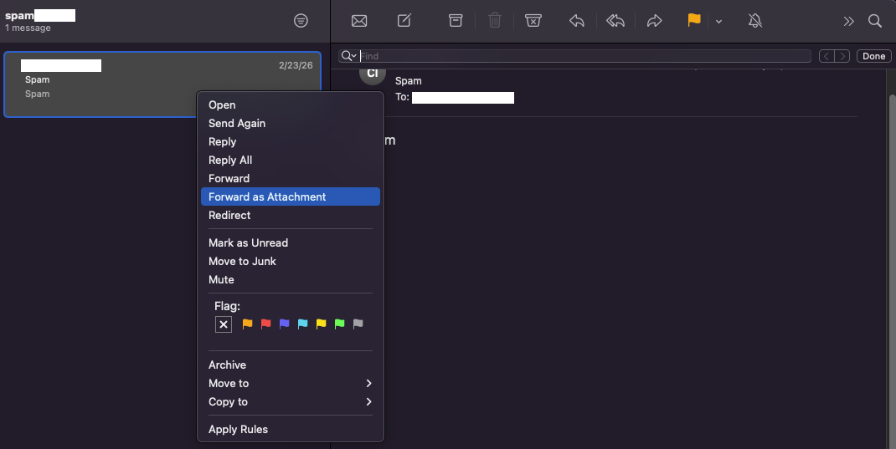
  </div>

### The analyst analyzes the email

The analyst navigates to the web page of ThePhish and clicks on the "List emails" button to obtain the list of emails to analyze.

<div align="center">
  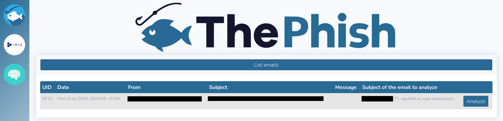
</div>

When the analyst clicks on the "Analyze" button related to the selected email, the analysis is started and its progress is shown on the web interface.

<div align="center">
  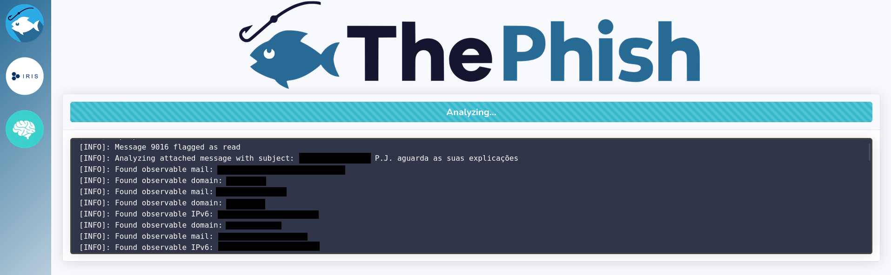
</div>

In the meantime, ThePhish extracts the observables (URLs, domains, IP addresses, email addresses, and attachments) from the email, then interacts with DFIR-IRIS to create the case.

Three tasks are created inside the case.

<div align="center">
  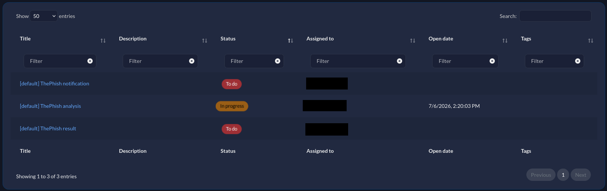
</div>

Each task has its own corresponding note.

<div align="center">
  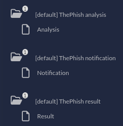
</div>

Then, ThePhish starts the first task ([default] ThePhish analysis) and populates the IOC and evidence fields with the observables found.

+ IOCs:

  <div align="center">
    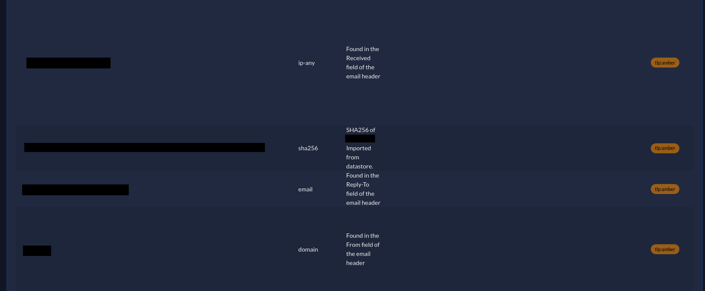
  </div>

+ Evidences:

  <div align="center">
    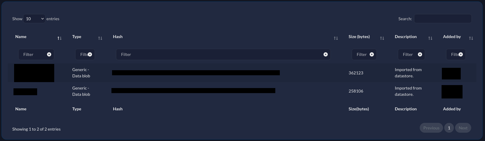
  </div>

At this point the second task is started ([default] ThePhish notification) and the user is notified via email that the analysis has started thanks to the *Wailer* responder.

<div align="center">
  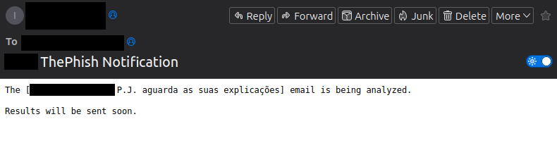
</div>

The contents of the "Notification" note allow the *Wailer* responder to send the notification via email.

The second task is then closed, and the analysis proceeds. 

The analysis progress is shown on the web interface while the analyzers are started.

<div align="center">
  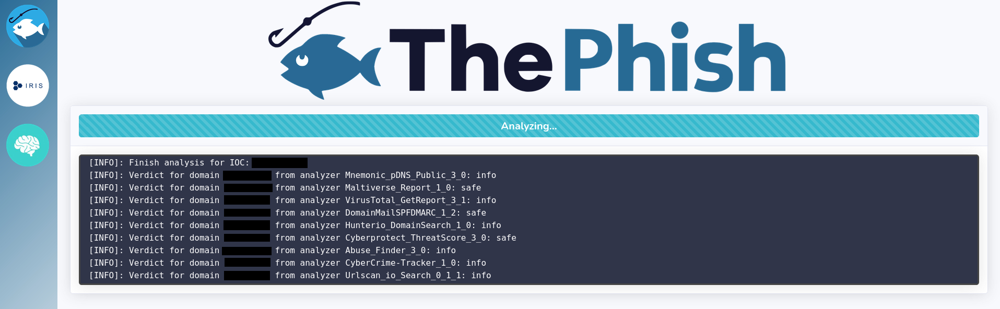
</div>

Once all the analyzers have terminated their execution, ThePhish populates the "Analysis" note with the analyzers' verdicts and calculates the final verdict. The first task is then closed, and the third one ([default] ThePhish result) is started.

ThePhish sends the verdict via email to the user thanks to the *Wailer* responder.

<div align="center">
  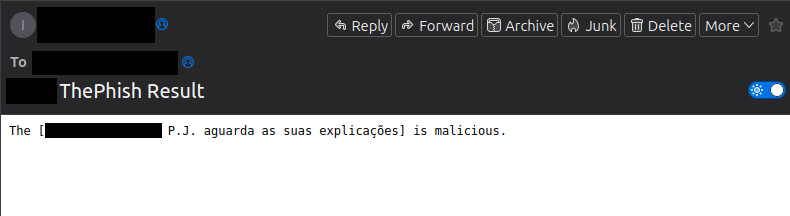
</div>

Finally, both the task and the case are closed. The note of the third task allows the *Wailer* responder to send the verdict via email. Moreover, the case has been closed after five minutes and resolved as "True Positive without impact", which means that the attack has been detected before it could do any damage.

Once the case is closed, the verdict is available for the analyst on the web interface together with the entire log of the analysis progress.

<div align="center">
  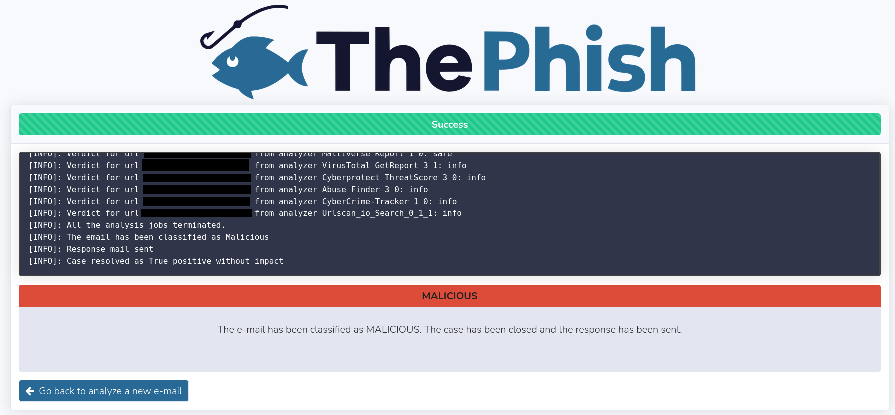
</div>

At this point the analyst can go back and analyze another email. The above-depicted case was related to a phishing email, but a similar workflow can be observed when the analyzed email is classified as "safe".

<div align="center">
  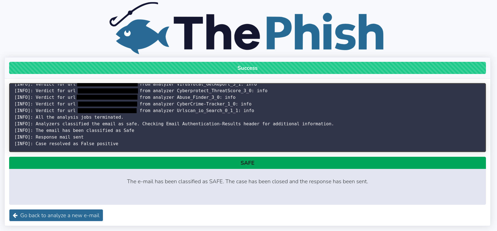
</div>

On the other hand, when an email is classified as "suspicious", the verdict is only displayed to the analyst on the web interface.

<div align="center">
  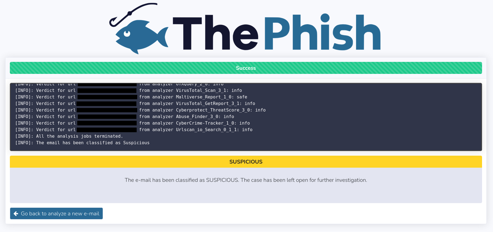
</div>
	
At this point, the analyst needs to use the buttons on the left-hand side of the page to use DFIR-IRIS and Cortex for further analysis. This is because the analysis has not been completed yet, and so the user is only notified that the analysis of the email that he forwarded to ThePhish has been started. The last task and the case have not been closed yet since they need to be closed by the analyst himself once he elaborates a final verdict. 

The analyst can view the reports of all the analyzers on DFIR-IRIS and Cortex.

+ DFIR-IRIS - IOCs:

  <div align="center">
    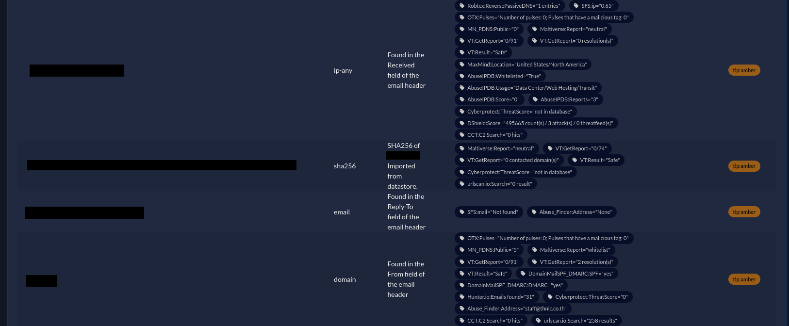
  </div>

+ DFIR-IRIS - IOCs - Cortex Reports:

  <div align="center">
    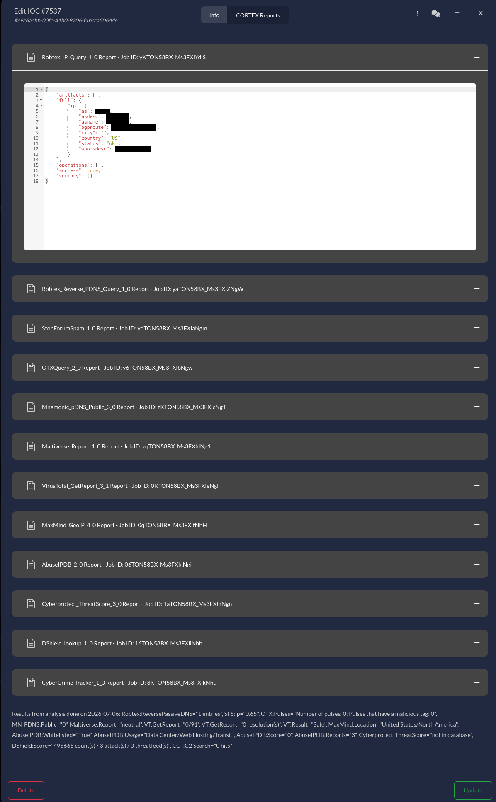
  </div>

+ Cortex - Jobs History:

<div align="center">
  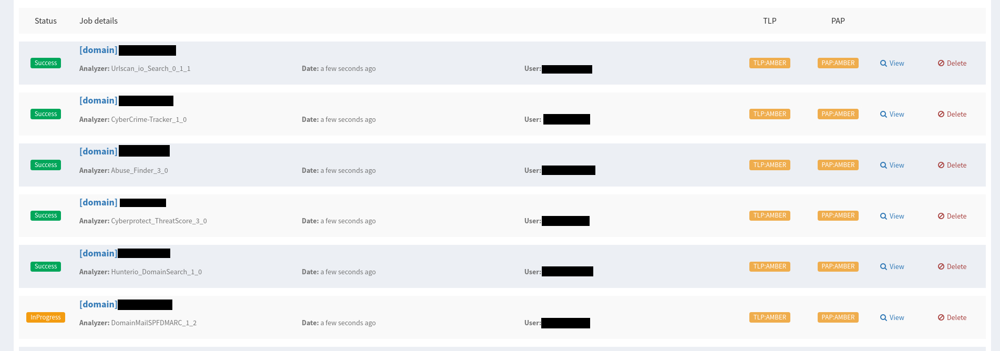
</div>

In case this is revealed not to be enough, he can also download the EML file of the email and analyze it manually.

<div align="center">
  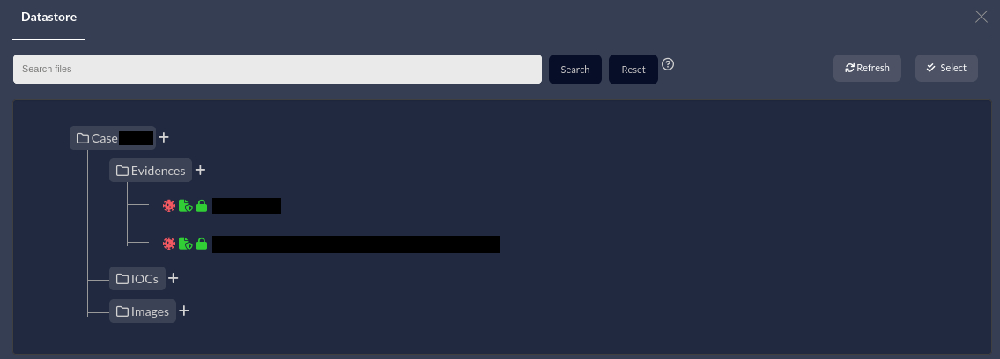
</div>

When the analyst terminates the analysis, he can populate the body of the email to send to the user in the description of the last task, start the *Wailer* responder and then close the case.

## Requirements

To deploy **ThePhishStack** it's required to have a Linux system with Docker and Docker Compose installed. Additionally, it's required to have working instances of both DFIR-IRIS and Cortex. The original [ThePhish](https://github.com/emalderson/ThePhish/tree/master/docker) documentation provides an example of a Cortex deployment.

In order for DFIR-IRIS to run Cortex analyzers, the [iris_cortexanalyzer_module](https://github.com/cybersec-ipb-pt/iris-cortexanalyzer-module) must be installed and configured.

To send email notifications, it's required to install and configure [iris_cortex_mailer_responder_module](https://github.com/cybersec-ipb-pt/iris-cortex-mailer-responder-module) on DFIR-IRIS, alongside the **Wailer** responder on Cortex.

Wailer is a fork of the [Mailer](https://thehive-project.github.io/Cortex-Analyzers/responders/Mailer/) responder, modified to work with DFIR-IRIS. The responder is available on the same GitHub repository as the responder module for DFIR-IRIS.

This version of ThePhish automatically creates the necessary case [template](./docker/src/CaseTemplate.json) on DFIR-IRIS, however, it's required to have a case classification with "**phishing**" as its name present on the platform.

Lastly, due to some limitations on the DFIR-IRIS API, both **ThePhishStack** and DFIR-IRIS must use the same time zone. 

This is because DFIR-IRIS does not return the job ID when invoking a module from the [API](https://docs.dfir-iris.org/_static/iris_api_reference_v2.0.2.html#tag/Iris-Modules/operation/post-dim-hooks-call). For **ThePhishStack** to track the [job status](https://docs.dfir-iris.org/_static/iris_api_reference_v2.0.2.html#tag/Iris-Modules/operation/get-dim-tasks-list), it does so by the timestamp of when the job concluded and the case ID.

This means that it's recommended that no other jobs be started while the analysis is in progress.

By default, DFIR-IRIS uses UTC, but if that is not the case in your setup, make sure to configure **ThePhishStack** to use the same timezone.

## Installation

This version of ThePhish is only available as a Docker image that needs to be built.

Start by cloning the repository

```bash
git clone https://github.com/cybersec-ipb-pt/ThePhishStack.git
```

Next, execute the following commands to build the image.

```bash
cd ThePhishStack
docker compose build
```

Once the image is built, the next step consists of configuring the solution as needed.

## Configuration

It's required to configure the [Container Environment Variables](#container-environment-variables) and the [configuration.json](#configurationjson) file in order to execute **ThePhishStack**.

Depending on the setup, it may also be required to modify the [analyzers_level_conf.json](#analyzers_level_confjson) file and/or the [whitelist.json](#whitelistjson) file.

Additionally, it's also recommended to configure a [Reverse Proxy](#reverse-proxy) for encryption.

The following documentation describes those steps.

### Container Environment Variables

**ThePhishStack** provides 4 environment variables.

The first 3 are related to the frontend of the service:

- **DFIR_IRIS_URL** allows defining the URL of DFIR-IRIS that will be used on ThePhishStack webpage. 

- The same applies to **CORTEX_URL**.

- **ROOT_PATH** defines the base URL path where **ThePhishStack** will listen for incoming requests (e.g., /thephish).

The 4th one, **TZ** is related to the time zone that service will use.

All these variables can be defined in the [docker-compose.yml](./docker-compose.yml) file.

### configuration.json

The file [configuration.json](./configuration.json) is the global configuration file that allows setting the parameters for the connection to the mailbox and to the DFIR-IRIS instance. It also allows setting parameters related to the cases that will be created, alongside some other customization parameters.

```json
{
  "email_filter": {
    "domains" : "",
    "subject" : ""
  },
  "skip_ioc_analysis": {
    "emails": "",
    "domains": ""
  },
  "imap": {
    "host" : "imap.gmail.com",
    "port" : "993",
    "user" : "",
    "password" : "",
    "folder" : "inbox"
  },
  "iris": {
    "url": "http://dfir-iris",
    "apikey": "",
    "verify_cert": true
  },
  "dim": {
    "cortex_analyzer_module_name": "iris_cortexanalyzer_module",
    "cortex_mailer_responder_module_name": "iris_cortex_mailer_responder_module"
  },
  "case" : {
    "customer_id": "customer_id",
    "reviewer_id": "reviewer_id",
    "owner_id": "owner_id",
    "severity": "Informational",
    "send_start_notification": true,
    "start_notification_subject": "case_id ThePhish Notification",
    "start_notification_message": "The [inf_email] email is being analyzed.\n\nResults will be sent soon.",
    "send_malicious_result_notification": true,
    "send_safe_result_notification": true,
    "send_result_subject": "case_id ThePhish Result",
    "verdict_messages": {
      "malicious": "The [inf_email] is malicious.",
      "suspicious": "The [inf_email] is suspicious.",
      "safe": "The [inf_email] is safe."
    }
  }
}
```

- In the `email_filter` section, filters can be applied in order for **ThePhishStack** to only enumerate emails that come from a certain list of origins (`domains`) and/or only enumerate emails that contain a certain value in the `subject`. Use commas to separate the values.
- In the `skip_ioc_analysis` section, filters can be applied in order for IOCs to be skipped and to not waste time analyzing them with Cortex. Although they are not analyzed, the IOCs are created and registered in DFIR-IRIS. Use commas to separate the values.
- In the `imap` section, define the `host`, `port`, `user`, `password` and `folder` to connect to the IMAP server.
- In the `iris` section, define the `url` and `apikey` to connect to the DFIR-IRIS server. The user related to the `apikey` should have permissions to read customers and read/write case templates. Also define if the server certificate should be validated or not (`verify_cert`). If the server uses a self-signed certificate, set it to false.
- The `dim` section defines the name of the DFIR-IRIS modules. No need to change these values.
- In the `case` section, a lot of different values can be define.
  - The `customer_id` field defines the customer that the case will be related to on DFIR-IRIS.
  - The `reviewer_id` field defines the user that will be used to mark the case as reviewed. **ThePhishStack** automatically sets the case as reviewed if it closes it.
  - The `owner_id` field defines the case owner.
  - The `severity` field defines the case severity. These are the values that can be used: `Medium`; `Unspecified`; `Informational`; `Low`; `High`; `Critical`.
  - The `send_start_notification` field defines if **ThePhishStack** should send the start analysis notification.
  - The `start_notification_subject` field defines the subject used by the start analysis notification. **ThePhishStack** replaces `case_id` by the value of the DFIR-IRIS Case Number if defined in this field.
  - The `start_notification_message` field defines the content of the start analysis notification.
  - The `send_malicious_result_notification` field defines if the result notification should be sent if the verdict is equal to *Malicious*.
  - The `send_safe_result_notification` field defines if the result notification should be sent if the verdict is equal to *Safe*.
  - The `send_result_subject` field defines the subject used by the result notification. **ThePhishStack** replaces `case_id` by the value of the DFIR-IRIS Case Number if defined in this field.
  - The `verdict_messages` section allows defining the email body used for the various verdicts in the results notification. If `inf_email` is present in those fields, it will be replaced by the subject of the email being analyzed.

### analyzers_level_conf.json

> Each analyzer outputs a report in JSON format that contains a maliciousness level for an observable that can be one of "info", "safe", "suspicious" or "malicious". However, even though the report structure usually follows a convention, this convention is not always respected. Moreover, after the analysis of the code of many analyzers and several tests by the original ThePhish developer, some analyzers have been found to contain bugs. For this reason, some tweaks and workarounds have been used either to obtain the maliciousness levels provided by these analyzers anyway or to prevent the application from crashing due to those bugs.
>
> - *Source: [Original ThePhish Documentation](https://github.com/emalderson/ThePhish/tree/master#configure-the-levels-of-the-analyzers)*

This version of the [analyzers_level_conf.json](./analyzers_level_conf.json) file has been updated to include the newest versions of the analyzers and remove those that are no longer maintained.

Refer to the original documentation to better understand how to add or remove analyzers in this file.

### whitelist.json

> ThePhish allows creating a whitelist in order to avoid analyzing observables that may cause false positives or that the analyst decides that they should not be considered during the analysis.
>
> - *Source: [Original ThePhish Documentation](https://github.com/emalderson/ThePhish/tree/master#use-the-whitelist)*

Refer to the original documentation to better understand how to modify the [whitelist.json](./whitelist.json) file.

Keep in mind that values defined in this file, when found on an email, will be excluded from the case.

### Reverse Proxy

**ThePhishStack** does not natively support TLS/SSL encryption. A reverse proxy must be deployed in front of the service to handle HTTPS traffic securely.

The configuration block below routes incoming traffic from Nginx to **ThePhishStack**:

```conf
location /thephish {
    add_header 'Access-Control-Allow-Methods' 'GET, POST, OPTIONS';
    proxy_pass http://127.0.0.1:8080/thephish;
    proxy_set_header X-Forwarded-For $proxy_add_x_forwarded_for;
    proxy_set_header X-Forwarded-Proto $scheme;
    proxy_set_header X-Forwarded-Host $host;
    proxy_set_header Upgrade $http_upgrade;
    proxy_set_header Connection "Upgrade";
    proxy_set_header Host $http_host;
    proxy_connect_timeout 1200s;
    proxy_send_timeout    1200s;
    proxy_read_timeout    1200s;
}
```

Ensure to update the docker-compose.yml file so the container binds strictly to localhost rather than exposing its port to the public internet:

```yml
    ports:
      - "127.0.0.1:8080:8080"
```